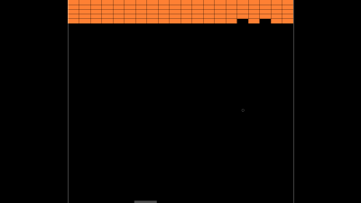

[](https://travis-ci.org/jean553/rust-breakout)

# rust-breakout



A simple breakout video game developed using Rust.

**NOTE**: This is only an experimental project only for learning purposes. 
There is no goal to make something good or enjoyable, only something optimized.

## Compilation and development

Start the docker container.

```bash
vagrant up
```

Connect to the container.

```bash
vagrant ssh
```

Compile the program.

```bash
cargo build --release
```

## Run

On your host:

```bash
./rust-breakout/target/release/rust-breakout
```

## Generate documentation

```bash
cargo rustdoc -- --no-defaults
```
